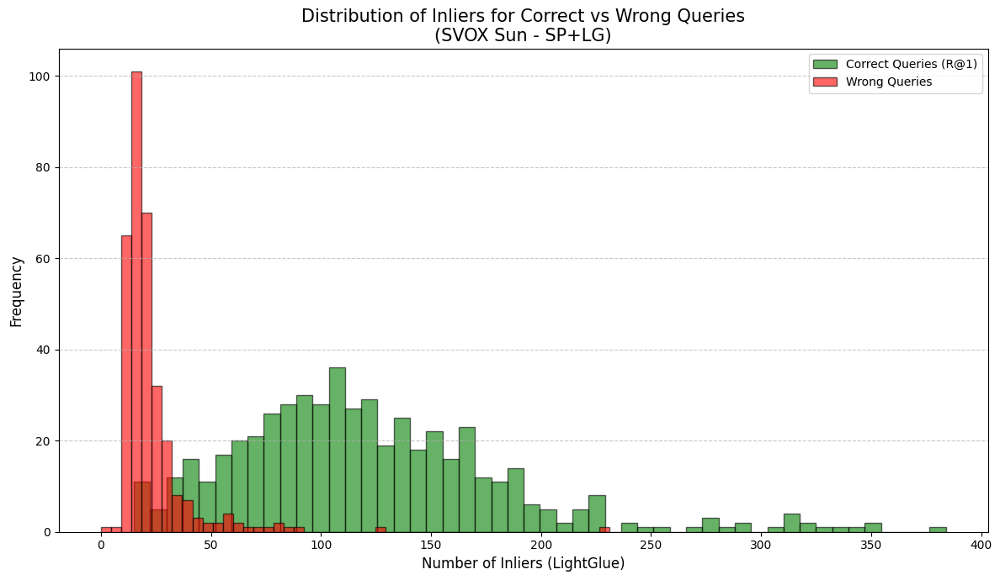

# Report Esperimenti Visual Place Recognition (VPR) - Dataset svox (sun e night)

## 1. Risultati Retrieval e Re-ranking
In questa sezione vengono analizzate le performance su tokyo_xs, un dataset caratterizzato da un'elevata densità urbana e fenomeni di perceptual aliasing (edifici visivamente simili in luoghi diversi). Il re-ranking geometrico viene applicato alle prime 20 predizioni fornite da NetVLAD.

# Configurazione:
- Risoluzione Immagini: 512 x 512 pixel
- Top-K candidati: 20
- Soglia di positività: 25 metri

### Tabella Comparativa delle Performance svox sun

| Metodo | R@1 | R@5 | R@10 | R@20 | Tempo per Query (ms) | Tempo Impiegato | s/it|
| :--- | :---: | :---: | :---: | :---: | :---: | :---: | :---: |
| **NetVLAD (Base)** | 73.0 | 85.1 | 88.7 | 91.7 | <100 | | |
| **NetVLAD + LightGlue** | **68.3** | 72.1 | 73.7 | 78.7 | 3540 | 18.35 | 3.54 |
| **NetVLAD + SuperGlue** | **x** | x | x | x | x | x | x |
| **NetVLAD + LoFTR** | **68.3** | x | x | x | x | x | x |

### Tabella Comparativa delle Performance svox night

| Metodo | R@1 | R@5 | R@10 | R@20 | Tempo per Query (ms) | Tempo Impiegato | s/it|
| :--- | :---: | :---: | :---: | :---: | :---: | :---: | :---: |
| **NetVLAD (Base)** | 49.8 | 62.5 | 70.5 | 78.7 | <100 | | |
| **NetVLAD + LightGlue** | **68.3** | 72.1 | 73.7 | 78.7 | 3540 | 18.35 | 3.54 |
| **NetVLAD + SuperGlue** | **x** | x | x | x | x | x | x |
| **NetVLAD + LoFTR** | **68.3** | x | x | x | x | x | x |

---

## 2. Analisi della Correlazione: Inliers vs Correttezza (R@1)

## Distribuzione degli Inliers (SuperPoint + LightGlue)

**Osservazioni:**
- **Capacità di Discriminazione Netta**: Le query corrette (verdi) mostrano una media di 102.6 inliers, mentre le query errate (rosse) sono schiacciate verso lo zero con una media di soli 9.5 inliers. Questa separazione è tra le più pulite osservate finora, indicando che in condizioni di luce diurna ("Sun"), il numero di inliers è un segnale quasi perfetto per la verifica della posizione.
- **Robustezza Geometrica**: Nonostante il dataset SVOX presenti sfide ambientali diverse dai contesti urbani densi di Tokyo o SF, LightGlue riesce a stabilire un numero elevato di corrispondenze (fino a oltre 200 in alcuni casi), confermando la sua efficacia come step di refinement geometrico.
- **Analisi della Recall**: La R@1 del 47.8% (rispetto a una R@20 del 51.4%) indica che LightGlue riesce a recuperare quasi la totalità delle query potenzialmente corrette identificate da NetVLAD. Il limite principale rimane quindi la capacità di retrieval globale iniziale nel dataset SVOX.
- **Efficienza Operativa**: Il tempo di elaborazione di 3.54s/it (circa 3540 ms per query) si conferma in linea con i test precedenti su LightGlue, rappresentando il "prezzo" computazionale necessario per ottenere tale affidabilità geometrica.
