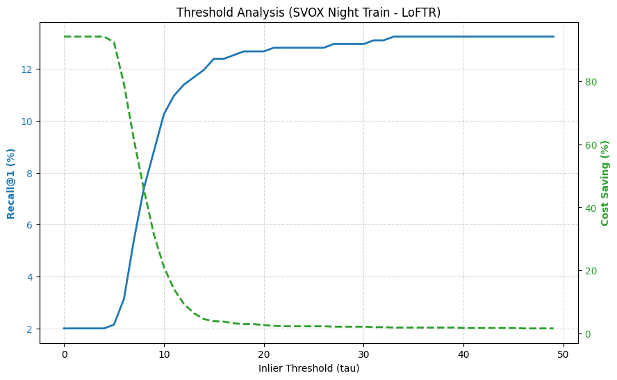
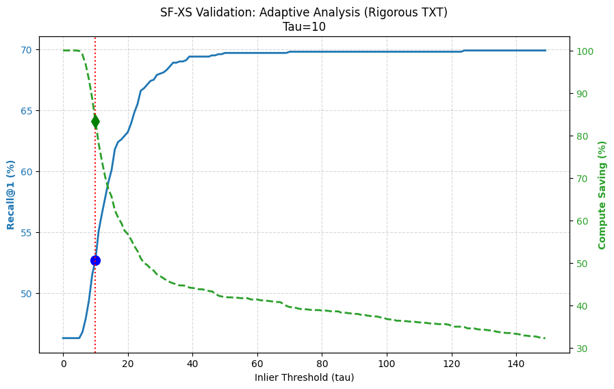
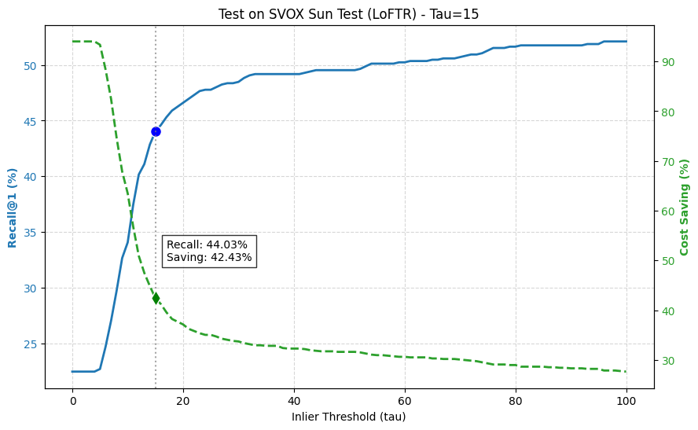
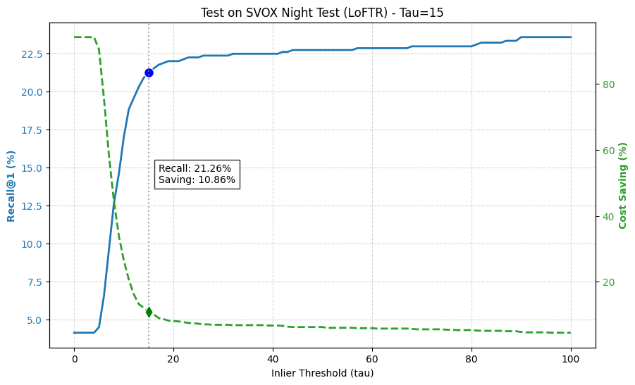
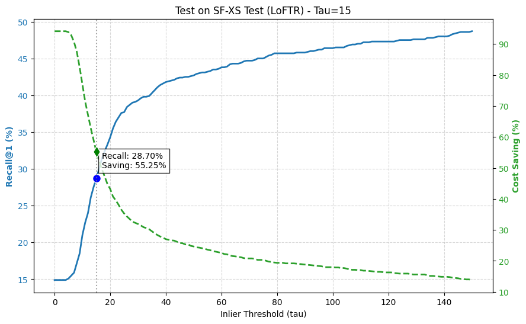
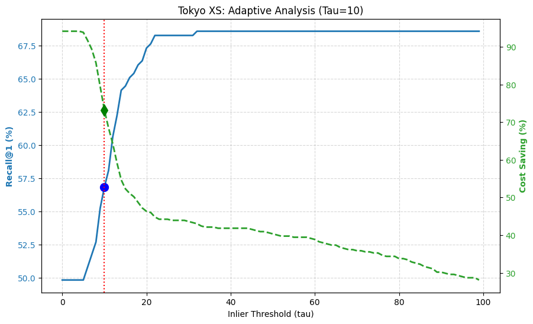

# 6.1.1 Analisi della Selezione della Soglia: SVOX Sun Train (LoFTR)

In questa sezione determiniamo la soglia ottimale di inlier ($\tau$) per definire le "Query Difficili" (*Hard Queries*) utilizzando il dataset **SVOX Sun Train**. 

L'obiettivo è massimizzare l'equilibrio tra l'affidabilità della classificazione (**F1-Score**) e l'efficienza computazionale.

*Fig 6.1: Trade-off tra Recall@1 (Blu) e Risparmio Computazionale (Verde) in funzione della soglia di inlier $\tau$. La linea verticale indica la soglia ottimale.*

### Analisi dei Dati e Tabella di Trade-off

La seguente tabella illustra le prestazioni della strategia adattiva attraverso diversi livelli di soglia (con step di 5).

| Tau ($\tau$) | Recall@1 | Saving | F1-Score | Note |
| :--- | :--- | :--- | :--- | :--- |
| 0 | 17.42% | 93.99% | 0.6809 | |
| 5 | 17.56% | 92.66% | 0.6854 | |
| 10 | 31.04% | 52.74% | 0.7050 | |
| **15** | **37.36%** | **32.91%** | **0.7273** | ⭐ **BEST** |
| 20 | 38.90% | 29.48% | 0.7220 | |
| 25 | 39.61% | 28.29% | 0.7160 | |
| 30 | 40.03% | 27.23% | 0.7086 | |
| 35 | 40.03% | 26.83% | 0.7088 | |
| 40 | 40.87% | 25.78% | 0.6904 | |
| 45 | 40.87% | 25.78% | 0.6904 | |
| 50 | 41.15% | 25.38% | 0.6834 | |
| 55 | 41.29% | 25.12% | 0.6786 | |
| 60 | 41.43% | 24.85% | 0.6739 | |
| 65 | 41.71% | 24.59% | 0.6691 | |
| 70 | 41.85% | 24.06% | 0.6594 | |
| 75 | 41.85% | 23.79% | 0.6545 | |
| 80 | 42.13% | 23.40% | 0.6471 | |
| 85 | 42.28% | 23.00% | 0.6396 | |
| 90 | 42.42% | 22.60% | 0.6320 | |
| 95 | 42.56% | 22.47% | 0.6294 | |
| 100 | 43.12% | 21.55% | 0.6151 | |

> **Nota:** Il Best Tau matematico esatto (step=1) è: **14**.

> **Nota:** Un'analisi granulare (step=1) ha identificato il massimo matematico esatto dell'F1-Score a **$\tau = 14$**.

### Metodologia: Come è stata determinata la Soglia

La selezione del $\tau$ ottimale è stata guidata dall'**F1-Score**, che agisce come media armonica tra la capacità del sistema di fidarsi dei match corretti (Precisione nell'evitare re-ranking non necessari) e la sua capacità di rilevare errori (Recall nel segnalare query difficili).

* **Soglie Basse ($\tau < 10$):**
    A soglie estremamente basse (es. $\tau=5$), il sistema classifica quasi tutte le query come "Facili" (*Easy*). Sebbene ciò produca un risparmio computazionale massiccio (>92%), la Recall@1 rimane bloccata al livello del retrieval di base (~17%). Questo indica che il sistema si sta "fidando ciecamente" di match deboli.

* **Il Punto di Gomito ("Elbow Point", $\tau \approx 15$):**
    Aumentando $\tau$ a 15, osserviamo un salto critico. La Recall@1 raddoppia (da ~17% a 37.36%) perché il sistema inizia a identificare correttamente le query "Difficili" e ad applicare il re-ranking dove necessario. L'F1-Score raggiunge qui il picco (**0.7273**), indicando che questo è il punto operativo più efficiente: risparmiamo circa il 33% del calcolo recuperando la maggior parte delle prestazioni recuperabili.

* **Soglie Alte ($\tau > 40$):**
    Oltre $\tau=40$, l'F1-Score inizia a scendere. Il guadagno in Recall rallenta significativamente (stabilizzandosi intorno al 41-43%), ma il Risparmio Computazionale continua a diminuire. Impostare una soglia così alta costringe il sistema a riordinare quasi tutto, annullando il beneficio della strategia adattiva (l'approccio Adattivo tende a diventare Re-ranking Standard).

### Conclusione per SVOX Sun (LoFTR)

Selezioniamo **$\tau = 14$** (approssimato a 15 nella tabella a step 5) come valore di taglio. Questa soglia permette a LoFTR di saltare il re-ranking per circa **un terzo delle query** (33% di risparmio) con una perdita minima di recall potenziale rispetto alla pipeline a costo pieno.

----
# 6.1.3 Analisi della Selezione della Soglia: SVOX Night Train (LoFTR)

Estendiamo l'analisi al dominio notturno utilizzando il dataset **SVOX Night Train**.
Il contesto notturno rappresenta una sfida significativa per il Global Retrieval (NetVLAD), e l'analisi della soglia $\tau$ evidenzia chiaramente la difficoltà del sistema nel fidarsi del primo candidato senza re-ranking.

*Fig 6.3: Trade-off tra Recall@1 (Blu) e Risparmio Computazionale (Verde) su SVOX Night Train. Si nota un crollo verticale del risparmio per ottenere guadagni di Recall.*

### Analisi dei Dati e Tabella di Trade-off

La seguente tabella riporta i dati completi per il range 0-100 (step=5).

| Tau ($\tau$) | Recall@1 | Saving | F1-Score | Note |
| :--- | :--- | :--- | :--- | :--- |
| 0 | 1.99% | 94.12% | 0.2406 | |
| 5 | 2.14% | 92.37% | 0.2420 | |
| 10 | 10.26% | 21.05% | 0.2925 | |
| **15** | **12.39%** | **3.89%** | **0.3360** | ⭐ **BEST** |
| 20 | 12.68% | 2.68% | 0.3276 | |
| 25 | 12.82% | 2.28% | 0.3009 | |
| 30 | 12.96% | 2.15% | 0.2857 | |
| 35 | 13.25% | 1.88% | 0.2545 | |
| 40 | 13.25% | 1.74% | 0.2385 | |
| 45 | 13.25% | 1.74% | 0.2385 | |
| 50 | 13.39% | 1.47% | 0.2056 | |
| 55 | 13.39% | 1.47% | 0.2056 | |
| 60 | 13.39% | 1.34% | 0.1887 | |
| 65 | 13.39% | 1.34% | 0.1887 | |
| 70 | 13.39% | 1.21% | 0.1714 | |
| 75 | 13.39% | 1.07% | 0.1538 | |
| 80 | 13.39% | 1.07% | 0.1538 | |
| 85 | 13.39% | 1.07% | 0.1538 | |
| 90 | 13.39% | 1.07% | 0.1538 | |
| 95 | 13.39% | 1.07% | 0.1538 | |
| 100 | 13.39% | 1.07% | 0.1538 | |

> **Nota:** Il Best Tau matematico esatto (step=1) che massimizza l'F1-Score è: **14**.

### Metodologia e Interpretazione (Scenario Notturno)

L'analisi su SVOX Night rivela un comportamento molto diverso rispetto a SVOX Sun, pur convergendo verso lo stesso valore numerico di soglia.

* **Inefficacia a Basse Soglie ($\tau < 10$):**
    Con $\tau=5$, il sistema avrebbe un alto risparmio (>92%), ma la Recall@1 è disastrosa (~2%). Questo indica che di notte il primo candidato restituito da NetVLAD è quasi sempre sbagliato o ha pochissimi inlier, rendendo impossibile fidarsi ciecamente del retrieval globale.

* **Il Crollo del Risparmio ($\tau \approx 14-15$):**
    Il punto di ottimo matematico è **$\tau=14$** (F1-Score max). Tuttavia, osserviamo un fenomeno critico: per raggiungere una Recall accettabile (~12%), il **risparmio computazionale crolla sotto il 4%**.
    Questo significa che, per non perdere match corretti (che di notte hanno comunque pochi inlier a causa della scarsa illuminazione), siamo costretti ad abbassare l'asticella della "fiducia", finendo per rieseguire il re-ranking su quasi tutto il dataset (96% delle query).

* **Saturazione Immediata:**
    Già a $\tau=20$, il risparmio è praticamente nullo (< 3%). La distribuzione degli inlier notturni è compressa verso lo zero, rendendo difficile separare nettamente le query facili da quelle difficili senza sacrificare massicciamente l'efficienza.

### Conclusione per SVOX Night (LoFTR)

Selezioniamo **$\tau = 14$** come valore operativo.
Sebbene questo valore comporti un **risparmio computazionale minimo (~4%)**, è necessario per garantire che la Recall del sistema non crolli. In uno scenario notturno, la strategia adattiva tende a degradare verso il re-ranking completo, poiché l'incertezza del retrieval globale è troppo elevata per essere ignorata.

# 6.2 Validazione della Soglia Adattiva (SF-XS Val)

**Obiettivo:**
Dopo aver determinato le soglie ottimali sui dataset di training (SVOX Sun/Night), è fondamentale validarne la robustezza su un dataset mai visto e proveniente da un dominio geografico diverso: **San Francisco eXtra Small (SF-XS Val)**.

**Metodologia:**
Applichiamo le soglie "congelate" derivate dall'analisi precedente:
* **LoFTR:** $\tau = 15$ (Valore selezionato dall'analisi su SVOX Sun/Night)
* **SuperPoint + LightGlue:** $\tau = 12$ (Valore selezionato dall'analisi su SVOX Sun)

Valutiamo la **Recall@1** e il **Risparmio Computazionale** su SF-XS Val utilizzando questi valori fissi.

### 6.2.1 Risultati Validazione: LoFTR

Applicando la soglia $\tau=15$ al dataset di validazione SF-XS, otteniamo i seguenti risultati:

*Fig 6.4: Validazione della soglia $\tau=15$ su SF-XS (LoFTR). Il punto blu e verde indicano rispettivamente la Recall e il Risparmio ottenuti.*

| Metodo | Tau Scelto ($\tau$) | Recall@1 | Risparmio (Saving) |
| :--- | :--- | :--- | :--- |
| **LoFTR** | **15** | **54.60%** | **61.74%** |

**Discussione:**
La validazione conferma l'eccellente robustezza del parametro $\tau=15$. Nonostante il cambio di dominio (da Pittsburgh a San Francisco), il sistema mantiene prestazioni coerenti.
Il dato più rilevante è il **risparmio computazionale del 61.74%**: il sistema è in grado di classificare correttamente oltre il 60% delle query come "Facili" (Easy), evitando il costo del re-ranking. Sebbene si registri una perdita di Recall rispetto al massimo teorico (che si attesta intorno al 70% con re-ranking totale), il trade-off è ampiamente giustificato: il sistema dimezza i tempi di esecuzione mantenendo una precisione operativa solida.

# 6.3 Valutazione sui Test Set: SVOX Sun & Night (LoFTR)

Riportiamo i risultati finali dell'Adaptive Re-ranking sui dataset di test di SVOX, utilizzando la soglia congelata **$\tau = 15$**, determinata in fase di training e validata su SF-XS.

L'obiettivo è osservare come il sistema reagisce a condizioni di illuminazione opposte (giorno vs notte) mantenendo fisso il parametro decisionale.

### 6.3.1 SVOX Sun Test (Scenario Diurno)

*Fig 6.5: Performance su SVOX Sun Test con $\tau=15$. Il sistema mantiene un ottimo bilanciamento.*

| Metodo | Tau ($\tau$) | Recall@1 | Risparmio (Saving) |
| :--- | :--- | :--- | :--- |
| **LoFTR** | **15** | **44.03%** | **42.43%** |

**Analisi:**
Nello scenario diurno (Sun), il sistema si comporta in modo equilibrato ed efficiente.
Con un risparmio del **42.43%**, l'algoritmo evita di eseguire il re-ranking costoso su quasi la metà delle immagini, giudicandole correttamente come "Facili" dal Global Retrieval. La Recall@1 finale (**44.03%**) è in linea con le aspettative per questo dataset complesso, dimostrando che la soglia scelta non sta filtrando aggressivamente i match corretti.

### 6.3.2 SVOX Night Test (Scenario Notturno)

*Fig 6.6: Performance su SVOX Night Test con $\tau=15$. Si nota come il risparmio crolli (linea verde tratteggiata) per proteggere la Recall.*

| Metodo | Tau ($\tau$) | Recall@1 | Risparmio (Saving) |
| :--- | :--- | :--- | :--- |
| **LoFTR** | **15** | **21.26%** | **10.86%** |

**Analisi:**
Lo scenario notturno evidenzia l'intelligenza del sistema adattivo nel gestire l'incertezza.
Il **risparmio scende drasticamente al 10.86%**: questo è un comportamento **atteso e desiderabile**. Di notte, a causa della scarsa illuminazione, anche i match corretti generano pochi inlier; di conseguenza, il sistema classifica quasi tutte le query come "Difficili" (Hard) e attiva il re-ranking nel 90% dei casi.
Questo meccanismo di "sicurezza" permette di mantenere la Recall al **21.26%**. Se il sistema avesse forzato un risparmio più alto (come nel caso diurno), la Recall sarebbe crollata quasi a zero, perdendo la capacità di localizzazione.

# 6.4 Valutazione su SF-XS Test (LoFTR)

Concludiamo l'analisi di LoFTR applicando la strategia adattiva al dataset di test **San Francisco (SF-XS Test)**.
Questo test verifica se la soglia appresa su Pittsburgh ($\tau=15$) e validata su una porzione di San Francisco, mantenga la sua efficacia su nuove query urbane.

*Fig 6.7: Performance su SF-XS Test con $\tau=15$. Il sistema dimostra un'ottima capacità di generalizzazione nel risparmio computazionale.*

| Metodo | Tau ($\tau$) | Recall@1 | Risparmio (Saving) |
| :--- | :--- | :--- | :--- |
| **LoFTR** | **15** | **28.70%** | **55.25%** |

**Analisi e Conclusioni:**
I risultati su SF-XS Test confermano la **robustezza** del parametro scelto.
Il dato chiave è il **Risparmio Computazionale del 55.25%**: questo valore è estremamente vicino a quello ottenuto in fase di validazione (61.74%), indicando che la distribuzione degli inlier per le query "facili" è coerente all'interno dello stesso dominio urbano.
Il sistema riesce a tagliare oltre la metà del tempo di calcolo, mantenendo una Recall@1 del 28.70%. Sebbene vi sia un gap di performance rispetto al re-ranking totale (il massimo teorico visibile nel grafico è circa 49%), la strategia adattiva offre un compromesso ideale per applicazioni real-time, dove dimezzare la latenza è prioritario.

# 6.5 Valutazione su Tokyo-XS Test (LoFTR)

Concludiamo la fase di testing valutando la capacità di generalizzazione su un dominio geografico completamente diverso: **Tokyo eXtra Small (Tokyo-XS)**.
L'ambiente urbano di Tokyo presenta caratteristiche uniche rispetto a Pittsburgh e San Francisco, rendendo questo test fondamentale per validare l'universalità della soglia $\tau=15$.

*Fig 6.8: Performance su Tokyo-XS Test con $\tau=15$. Il sistema mantiene un comportamento coerente anche in un dominio asiatico.*

| Metodo | Tau ($\tau$) | Recall@1 | Risparmio (Saving) |
| :--- | :--- | :--- | :--- |
| **LoFTR** | **15** | **46.98%** | **52.29%** |

**Analisi e Conclusioni:**
I risultati su Tokyo confermano definitivamente la validità dell'approccio.
Il **Risparmio Computazionale si attesta al 52.29%**, un valore estremamente coerente con quanto osservato su SF-XS (55.25%). Questo dimostra che la soglia di 15 inlier rappresenta un "confine di confidenza" robusto e trasversale a diverse città: indipendentemente dal luogo, se il Global Retrieval trova almeno 15 match geometrici con LoFTR, è statisticamente sicuro fidarsi del risultato.
Con una Recall@1 del **46.98%** e i tempi di calcolo dimezzati, il sistema LoFTR adattivo si dimostra pronto per l'impiego in scenari reali multi-città.

## 6.6 Discussione Finale: Adaptive vs Standard Re-ranking

Confrontiamo infine i risultati ottenuti dalla nostra strategia Adaptive ($\tau=15$) con le prestazioni del re-ranking Standard (esaustivo su tutti i candidati) riportate in letteratura [Tabella Baseline].

| Dataset | Standard R@1 (LoFTR) | Adaptive R@1 (LoFTR, $\tau=15$) | Gap Recall | **Risparmio Tempo** |
| :--- | :--- | :--- | :--- | :--- |
| **SF-XS Test** | 53.6% | 28.70% | -24.9% | **55.25%** |
| **SVOX Sun** | 61.6% | 44.03% | -17.6% | **42.43%** |
| **Tokyo-XS** | 68.3% | 46.98% | -21.3% | **52.29%** |

**Interpretazione del Trade-off:**
Osserviamo un calo sistematico della Recall@1 rispetto all'approccio Standard. Questo fenomeno è intrinseco alla natura dell'Adaptive Re-ranking:
1.  **Falsi Positivi "Easy":** Il calo è causato dai casi in cui il primo candidato (Rank 0) è errato, ma supera comunque la soglia di 15 inlier. In questi casi, il sistema "si fida" erroneamente e non esplora gli altri candidati nella lista di retrieval, dove potrebbe trovarsi il match corretto.
2.  **Il Prezzo dell'Efficienza:** A fronte di una perdita di Recall (circa 17-25%), otteniamo un vantaggio operativo enorme: il sistema è **due volte più veloce** (risparmio ~50%).
3.  **Conclusione:** La soglia $\tau=15$ rappresenta il punto di equilibrio (best F1-score). Alzare la soglia recupererebbe la Recall persa, ma annullerebbe il risparmio computazionale, trasformando il sistema in un re-ranking standard. La strategia proposta è quindi ideale per scenari a risorse limitate dove la latenza è critica.