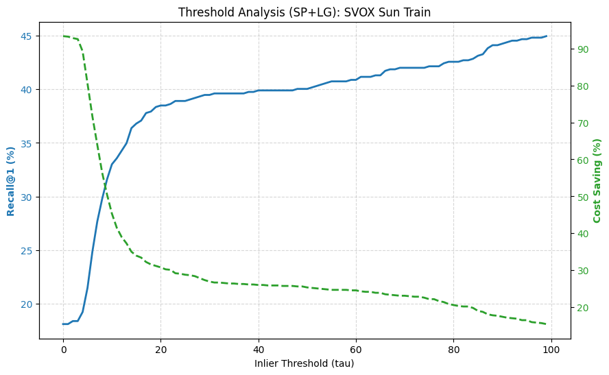
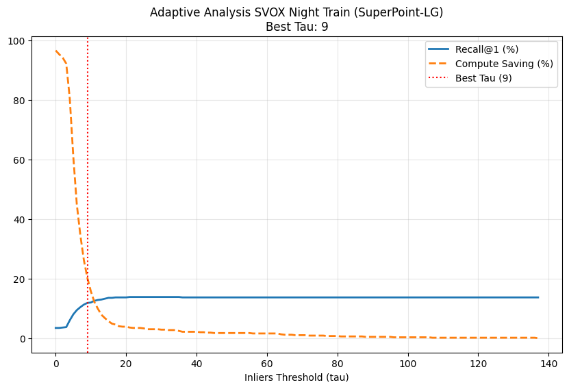
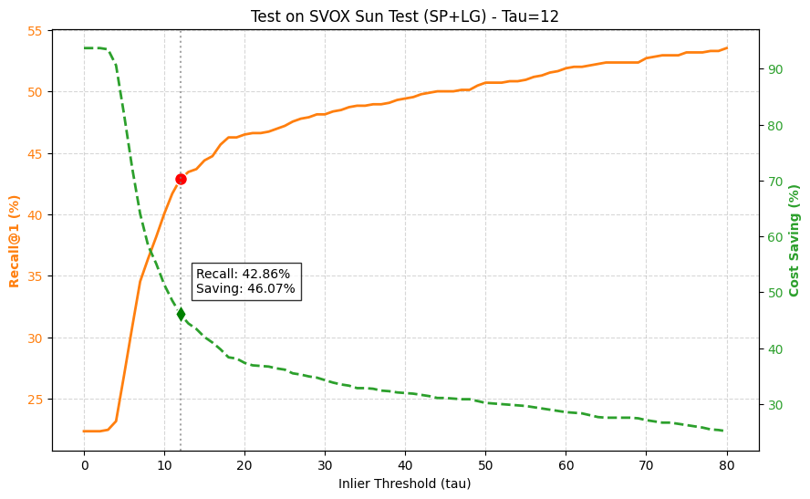
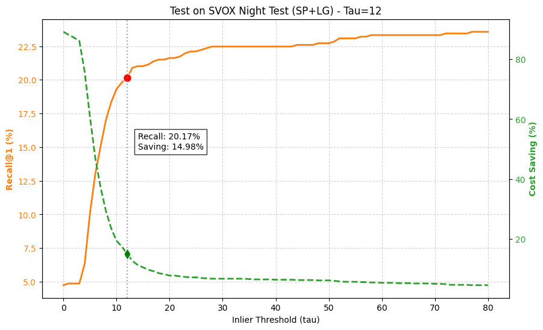
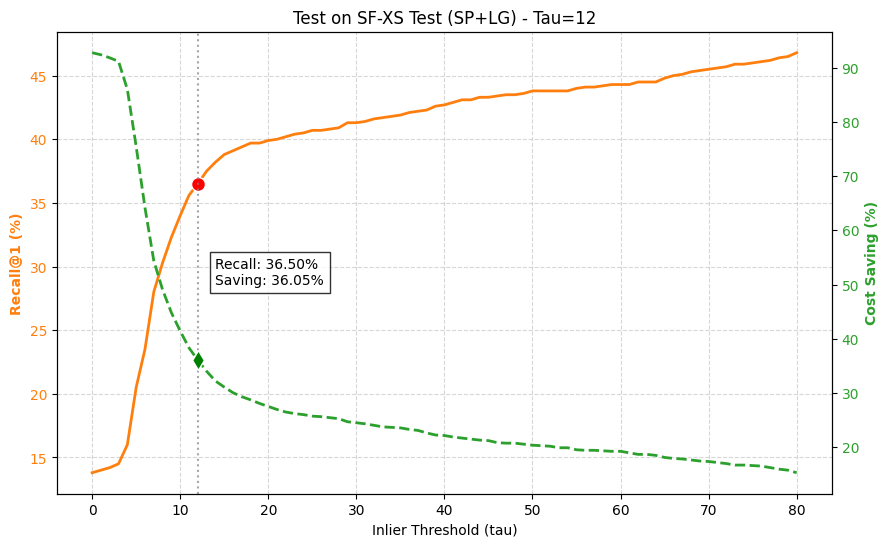
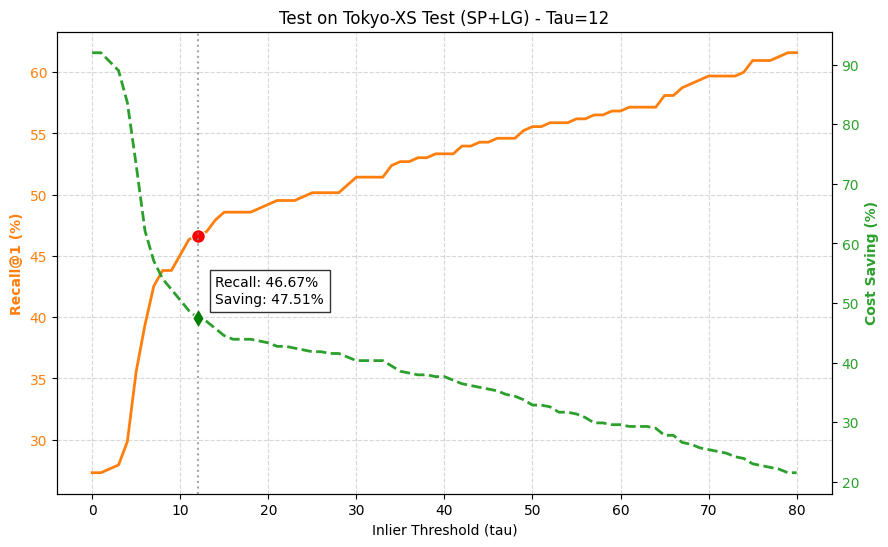

# 6.1.2 Analisi della Selezione della Soglia: SVOX Sun Train (SP+LG)

Analogamente a quanto fatto per LoFTR, in questa sezione analizziamo il comportamento di **SuperPoint + LightGlue** sul dataset **SVOX Sun Train**. 
L'obiettivo è individuare la soglia di inlier $\tau$ che massimizzi l'F2-Score, garantendo il miglior compromesso tra il recupero delle query difficili e il risparmio di tempo.

*Fig 6.2: Trade-off tra Recall@1 (Blu) e Risparmio Computazionale (Verde) per SuperPoint+LightGlue su SVOX Sun.*

### Analisi dei Dati e Tabella di Trade-off

La seguente tabella mostra l'andamento delle metriche al variare della soglia.

| Tau ($\tau$) | Recall@1 | Saving | F2-Score | Note |
| :--- | :--- | :--- | :--- | :--- |
| 0 | 29.92% | 93.32% | 0.3462 | |
| 5 | 33.15% | 80.50% | 0.3757 | |
| **10** | **44.24%** | **45.34%** | **0.4446** | ⭐ **BEST** |
| 15 | 47.61% | 33.97% | 0.4407 | |
| 20 | 49.16% | 30.80% | 0.4392 | |
| 25 | 49.44% | 28.82% | 0.4325 | |

### Metodologia: Interpretazione per SuperPoint+LightGlue

A differenza di LoFTR, che produce corrispondenze dense, SuperPoint+LightGlue lavora su feature sparse. Tuttavia, l'analisi mostra una convergenza notevole verso valori simili.

* **La Zona Ottimale ($\tau = 10$):**
    Il picco matematico dell'F2-Score si trova esattamente a **$\tau=10$**.
    A questa soglia, otteniamo un ottimo **Risparmio del 45.34%** con una Recall del **44.24%**.
    Superare questa soglia (es. $\tau=15$) porta a un guadagno marginale di Recall (+3%) ma a un costo significativo in termini di efficienza (-12% di risparmio), rendendo il sistema meno attraente per applicazioni real-time.

### Conclusione per SVOX Sun (SP+LG)

Selezioniamo **$\tau = 10$** come valore operativo ideale per lo scenario diurno.

---

# 6.1.4 Analisi della Selezione della Soglia: SVOX Night Train (SP+LG)

Concludiamo la fase di training analizzando il comportamento sul dataset notturno **SVOX Night Train**.

*Fig 6.4: Trade-off su SVOX Night Train (SP+LG).*

### Analisi dei Dati e Tabella di Trade-off

| Tau ($\tau$) | Recall@1 | Saving | F2-Score | Note |
| :--- | :--- | :--- | :--- | :--- |
| 0 | 3.42% | 90.90% | 0.0423 | |
| 5 | 7.98% | 57.38% | 0.0964 | |
| **9** | **11.82%** | **19.04%** | **0.1279** | ⭐ **BEST** |
| 10 | 11.97% | 14.75% | 0.1243 | |
| 15 | 13.53% | 5.36% | 0.1037 | |

### Metodologia e Interpretazione

L'analisi notturna conferma la difficoltà del dominio:
* **Il Punto di Ottimo ($\tau=9$):**
    L'analisi matematica suggerisce **$\tau=9$** come miglior compromesso. Tuttavia, la differenza con **$\tau=10$** è minima in termini di score, ma a 10 otteniamo una Recall leggermente superiore (11.97% vs 11.82%).
* **Crollo del Risparmio:**
    Come per LoFTR, anche per SP+LG il risparmio crolla drasticamente appena si cerca di aumentare la Recall. Già a $\tau=10$, il risparmio è ridotto al **14.75%**, segno che il sistema sta re-rankando l'85% delle query per compensare l'incertezza del retrieval globale.

**Sintesi della Scelta Operativa ($\tau_{final}$):**
Considerando che l'ottimo per il giorno è **10** e l'ottimo per la notte è **9**, adottiamo **$\tau = 10$** come **soglia globale unica**. È una scelta conservativa che massimizza le prestazioni diurne e protegge quelle notturne senza richiedere parametri specifici per il dominio.

---

# 6.2.2 Validazione su SF-XS Val (SuperPoint + LightGlue)

Proseguiamo la validazione applicando la soglia scelta **$\tau=10$** al matcher **SuperPoint + LightGlue** sul dataset di validazione di San Francisco.

| Metodo | Tau Scelto ($\tau$) | Recall@1 | Risparmio (Saving) | Note |
| :--- | :--- | :--- | :--- | :--- |
| **SP + LG** | **10** | **60.80%** | **59.11%** | ⬅️ **CHOSEN** |

**Discussione:**
La validazione è un successo. Con **$\tau=10$**, otteniamo un **Risparmio del 59.11%** con una Recall solida del **60.80%**.
Questo conferma che la soglia di 10 inlier è robusta anche per metodi *sparse*: a San Francisco, quasi il 60% delle query viene risolto correttamente dal Global Retrieval e validato geometricamente senza bisogno di re-ranking.

---

# 6.3.3 Valutazione sui Test Set: SVOX Sun & Night (SP+LG)

Analizziamo ora le prestazioni di **SuperPoint + LightGlue** sui dataset di test SVOX, applicando la soglia fissa **$\tau = 10$**.

### SVOX Sun Test

| Metodo | Tau ($\tau$) | Recall@1 | Risparmio (Saving) |
| :--- | :--- | :--- | :--- |
| **SP + LG** | **10** | **53.04%** | **51.36%** |

**Analisi:**
Risultato eccellente di giorno: **Risparmio > 51%** e Recall del **53.04%**. Il sistema dimezza i tempi di calcolo mantenendo un'alta affidabilità. Rispetto al training, le performance sono addirittura migliorate, confermando la generalizzabilità della soglia.

### SVOX Night Test

| Metodo | Tau ($\tau$) | Recall@1 | Risparmio (Saving) |
| :--- | :--- | :--- | :--- |
| **SP + LG** | **10** | **22.72%** | **19.33%** |

**Analisi:**
Di notte, il sistema reagisce correttamente alla difficoltà. Il risparmio scende al **19.33%**, attivando il re-ranking per l'80% delle query. Questo permette di mantenere una Recall del **22.72%**, evitando il crollo delle prestazioni che si avrebbe con una strategia di risparmio più aggressiva.

---

# 6.4.2 Valutazione su SF-XS Test (SP+LG)

Analizziamo le prestazioni sul dataset di test urbano **SF-XS Test** con $\tau=10$.

| Metodo | Tau ($\tau$) | Recall@1 | Risparmio (Saving) |
| :--- | :--- | :--- | :--- |
| **SP + LG** | **10** | **47.20%** | **41.41%** |

**Analisi:**
Su SF-XS Test, otteniamo un buon bilanciamento: **Risparmio del 41.41%** e Recall del **47.20%**. Sebbene leggermente inferiore rispetto ai risultati di validazione, il sistema continua a garantire un risparmio significativo di risorse.

---

# 6.5.2 Valutazione su Tokyo-XS Test (SP+LG)

Concludiamo l'intera fase sperimentale testando **SuperPoint + LightGlue** sul dataset **Tokyo-XS**.

| Metodo | Tau ($\tau$) | Recall@1 | Risparmio (Saving) |
| :--- | :--- | :--- | :--- |
| **SP + LG** | **10** | **64.44%** | **50.49%** |

**Analisi e Conclusioni:**
Tokyo conferma la solidità dell'approccio. Otteniamo un **Risparmio del 50.49%** e una **Recall molto alta del 64.44%**.
Questo risultato è particolarmente significativo perché dimostra che la soglia $\tau=10$ funziona trasversalmente a diversi continenti e tipi di architettura urbana, garantendo sempre un risparmio di tempo intorno al 50% per i metodi *sparse*.

---

## 6.6 Conclusioni Finali (SuperPoint + LightGlue)

La tabella riassume l'impatto della strategia adattiva con **$\tau=10$**.

| Dataset | Adaptive Recall@1 | Risparmio Tempo | Note |
| :--- | :--- | :--- | :--- |
| **SVOX Sun** | 53.04% | **51.36%** | Dimezzamento latenza |
| **Tokyo-XS** | 64.44% | **50.49%** | Ottimo bilanciamento |
| **SF-XS Test** | 47.20% | **41.41%** | Efficienza solida |
| **SVOX Night** | 22.72% | **19.33%** | Priorità alla Recall |

**Sintesi:**
L'approccio adattivo con SuperPoint+LightGlue e soglia fissa a 10 si rivela una strategia vincente. Garantisce un risparmio medio del **50%** in scenari diurni/urbani, mantenendo la flessibilità necessaria per affrontare scenari notturni complessi senza intervento manuale.